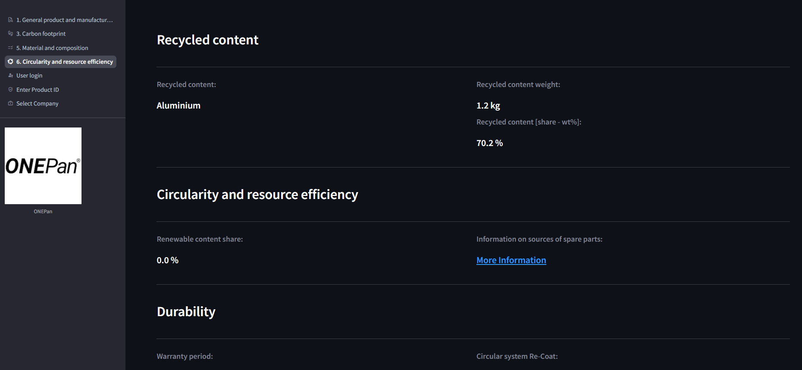

# Digital Product Passport (DPP) Application

Welcome to the Digital Product Passport (DPP) Application, This prototype has been developed as part of the SmartPass project. This document provides a comprehensive overview of the prototype, installation instructions, user and developer guides, and configuration details.


&nbsp;


## Table of Contents
1. [Quick Start](#quick-start)
2. [Architecture Overview](#architecture-overview)
3. [User Guide](#user-guide)
4. [Feature Guide: Product Updates](#feature-guide-product-updates)
5. [Developer Guide](#developer-guide)
6. [Machine Readable Code Verification](#machine-readable-code-verification)

<!-- vscode-markdown-toc-config
	numbering=true
	autoSave=true
	/vscode-markdown-toc-config -->

&nbsp;


## Quick Start


### 1. Install Docker Desktop
- Download and install Docker Desktop for your operating system:
	- [Windows](https://docs.docker.com/desktop/setup/install/windows-install/)
	- [Mac](https://docs.docker.com/desktop/setup/install/mac-install/)
	- [Linux](https://docs.docker.com/desktop/setup/install/linux/)
- Log in to Docker Desktop after installation.


### 2. Clone the Repository
```bash
git clone https://gitlab.com/smartpass/fullstack_app/dpp_smartpass.git
cd dpp_smartpass
```


### 3. Build and Run the Application
- Before running the application, it is needed to export HOST_IP in the terminal
	- For MacOS:
		```bash
			export HOST_IP=$(ifconfig | grep 'inet ' | grep -v '127.0.0.1' | awk '{print $2}' | head -n 1)
		```
	- For Windows (PowerShell):
		```bash
			$env:HOST_IP = (Get-NetIPAddress -AddressFamily IPv4 -InterfaceAlias (Get-NetConnectionProfile).InterfaceAlias).IPAddress
		```
- Run the multi-container application using Docker Compose:
	```bash
	docker compose up
	```
- Verify containers are running:
	```bash
	docker ps
	```
- To stop the containers:
	```bash
	docker compose down
	```


### 4. Access the Web Application
- Open your browser and navigate to: [http://localhost:8501/](http://localhost:8501/)


&nbsp;

## Architecture Overview

The DPP Application consists of two main components:


### DPP_API (Backend)
- Provides company data storage and the API for data exchange with the frontend.
- Built with Python and Flask.

### DPP_APP (Frontend)
- User-facing web application for viewing and updating Digital Product Passport parameters.
- Built with Python and Streamlit.


> **Note:** This project is a prototype designed to provide an overview of how to implement a DPP Application. Further development is required for a complete DPP implementation. The following table provides a summary of this.


| Part     | Kind         | Description/Functionality                                                                 | Included in Prototype                                                                                 | Further Development Needed |
|:---------|:-------------|:----------------------------------------------------------------------------------------|:-----------------------------------------------------------------------------------------------------|:---------------------------|
| DPP_API  | Feature      | [Access](#4-access-the-web-application): Local network access for demonstration.          | Runs locally for prototype demonstration.                                                            | Needs deployment to a public server or cloud service. |
|          |              | Data: Static and dynamic parameters relevant to the company.                            | Only key parameters are included.                                                                   | Add all parameters defined in SmartPass. |
|          |              | [Data Storage](#database): Data stored in local CSV files, not connected to company DB.  | Dummy database, CSV files only.                                                                     | Develop infrastructure for real-time digital data access (databases, document extraction, sensors, etc.). |
|          |              | Data Formats: Supports numeric, text, and file data.                                    | Supported.                                                                                          | |
|          |              | [Data Standardization](#developer-guide): Uses [Schema](https://schema.org), [XSD](http://www.w3.org/2001/XMLSchema#), and [GS1](https://gs1.org/voc/) standards.          | Standards applied in prototype.                                                                     | All contributors must follow the same standards. |
|          |              | Back-up: Data backup not included.                                                      | Not included.                                                                                       | Company must implement backup solutions. |
|          |              | Other Company Data Sources: Not included.                                               | Not included.                                                                                       | Add support for more stakeholders and data sources. Use [GS1 DigitalLink Resolver](https://github.com/gs1/GS1_DigitalLink_Resolver_CE) for integration. |
|          | Functionality | Database Connection: Reads CSV files.                                                    | CSV reading implemented.                                                                            | Develop interface for real company data sources. |
|          |              | Data Standardization: Converts raw data to model definitions using Schema, XSD, and GS1.     | Example transformation included.                                                                    | Define and implement missing parameters. See [how to do it](#developer-guide). |
|          |              | Endpoints: Public/private data via HTTP GET, dynamic data via HTTP POST.                 | Example endpoints provided.                                                                         | Add all parameters, improve security, and connect to real databases. |
| DPP_APP  | Feature      | [Access](#4-access-the-web-application): Local network access for demonstration.          | Runs locally for prototype demonstration.                                                            | Needs deployment to a public server or cloud service. |
|          |              | [Machine Readable Code](#machine-readable-code-verification): Embedded using standards.  | Machine readable code embedded using Schema, XSD, GS1.                                              | Define and implement missing parameters. See [how to do it](#developer-guide). |
|          | Functionality | [DPP Request](#2-enter-product-id): Enter product ID or scan QR code.                    | Product ID entry and QR code supported.                                                             | Use [QR code generator](./dpp_api/qr/qrCode.py) for more products. |
|          |              | [DPP Visualization](#3-navigate-parameters): View parameters as text or tables.          | Text and table views supported.                                                                     | Add more visualization types as needed. |
|          |              | [DPP Update](#feature-guide-product-updates): Create or update dynamic parameters.       | Supported.                                                                                          | |
|          |              | DPP Creation/End of Life: No interface for creation or deletion.                        | Not supported in prototype.                                                                        | Stakeholders must manage creation/deletion. See [how to do it](#developer-guide). |
|          |              | [Visualization Authentication](#4-log-in-for-private-access): User login, public/private roles. | Two roles: public (view) and private (edit/update).                                                 | Add more roles, improve security (token, data wallet, bankid, etc.). Modify roles/passwords in [credentials file](./dpp_app/src/credentials.yml). |
|          |              | [Update Authentication](#a-authentication): Dummy roles for update authentication.       | Dummy roles provided for updates.                                                                   | Define proper roles and improve authentication. Modify roles/passwords in [credentials file](./dpp_app/src/credentials.yml). |

***

&nbsp;


## User Guide

Follow these steps to view and update product data:


### 1. Select a Company
- Click the button below the company logo to access the DPP Company flow.
- For testing, scan the QR code for "Product 1" using your phone (ensure both devices are on the same network).


### 2. Enter Product ID
- Enter the product ID you wish to view.


### 3. Navigate Parameters
- Browse parameter categories for the selected product. You start in `Public Mode`.


### 4. Log In for Private Access
- Log in with your credentials to access `Private Mode` and additional features.


&nbsp;

## Feature Guide: Product Updates

Authorized users can manage product updates in `Private Mode`. In `Public Mode`, updates are view-only.


### 1. Add or Edit an Update
- Navigate to Product Updates.


#### a. Authentication
- Remember to login first to enable `Private Mode`, click **Add/Edit update** to authenticate.


#### b. Add/Edit a Row
- Click **Add row** to create a new update entry.
- **Note:** Some fields (Product ID, Update ID, Timestamp) are set automatically and cannot be edited.
- **Brighteco Special Case:** For Brighteco products, `Actual total weight` = `Virgin material weight` + `Recycled content`.


#### c. Save or Cancel
- Click **Save** to commit changes to the local database.
- Click **Cancel** to discard changes.


### 2. Data Handling

#### a. Write Data in Database
- Changes are saved locally until you click **Write data in database** to make them permanent.


#### b. Show Historic Updates
- All updates are preserved; previous data is never overwritten. View history by enabling **Show all including historic updates**.


&nbsp;

## Developer Guide

Instructions for modifying parameters, layout, and database structure.


- **Modify Parameter Name/Category:** Edit the relevant fields in the `configuration file` to change display names or categories in the DPP_APP layout.
- **Add a New Parameter:** Update both the configuration file and the database:
	- Add a row in `dpp_app/data/<company_name>/parameter_metadata_<company_name>.xlsx`.
	- Copy/Paste this file (`parameter_metadata_<company_name>.xlsx`) in `dpp_api/data/<company_name>`.
	- Add a column in `dpp_api/data/<company_name>/static.csv` (for static parameters) or `dynamic.csv` (for dynamic parameters).
- **Create DPP for New Product:** Add a new row in both `static.csv` and `dynamic.csv` for the product.


### Configuration File
- **Purpose:** Controls display names, categories, and layout of parameters in DPP_APP.
- **Location:** `dpp_app/data/<company_name>/parameter_metadata_<company_name>.xlsx`


a. Configuration File Structure

The configuration file consists of several sheets, each responsible for a specific aspect of the DPP_APP configuration:

* `parameter_metadata`: Defines the layout and organization of parameters in the DPP_APP.
	* `category`: The main topics shown in the [side navigation bar](#3-navigate-parameters).
	* `sub_category`: Allows grouping parameters within a category. For example, under `6. Circularity and resource efficiency`, subcategories include `Recycled content`, `Circularity and resource efficiency`, and `Durability`.
	  
	* `parameter`: The individual DPP parameters.
	* `order_parameter`: Specifies the display order of parameters on the main page.
	* `subparameter`: Breaks down a parameter into more detailed components, e.g., splitting "Manufacturing place" into "City" and "Address".
	* `access`: Indicates whether a parameter is public or private.
	* `data model definition string`: Contains the data model definition for each parameter. For guidance on constructing these definitions using GS1, Schema, and XSD vocabularies, refer to this <a href="https://www.gs1.org/docs/gs1-smartsearch/GS1_GTIN_OTW_Implementation_Guideline.pdf">document</a>.
* `parameter_metadata_original`: Reference sheet containing the original parameters from the SmartPass project. It is a copy of <a href="https://chalmersindustriteknik.sharepoint.com/:x:/r/sites/235035SmartPass/Delade%20dokument/General/Leveranser/Data%20Platform/Data_Parameters.xlsx?d=w7d6d7ab839bc4cf99de6f9b159e893f3&csf=1&web=1&e=HQ5j2f">Data_Parameters.xlsx</a>. This sheet is for reference only and is not used by the DPP_APP.
* `category_metadata`: Specifies details for each category.
	* `category`: All categories defined in `parameter_metadata`.
	* `function_name`: Internal name for each category in DPP_APP. Must use only alphanumeric characters and underscores.
	* `icon_category`: Icon shown for each category in the [side navigation bar](#3-navigate-parameters). Icons are from [Google Material Symbols](https://fonts.google.com/icons?icon.set=Material+Symbols&icon.style=Rounded), with names in lowercase and spaces replaced by underscores (e.g., `info_icon`).
* `sub_category_metadata`: Specifies details for each subcategory.
	* `sub_category`: All subcategories defined in `parameter_metadata`.
	* `conf_print`: Determines how parameters under a subcategory are displayed: as text (e.g., [General product and manufacturer information](#3-navigate-parameters)) or as a table (e.g., [product updates](#a-authentication)).
&nbsp;

### Database
- **Purpose:** Stores company data.
- **Location:**
	- Dynamic: `dpp_api/data/<company_name>/dynamic.csv`
	- Static: `dpp_api/data/<company_name>/static.csv`


## Machine Readable Code Verification

Parameters are visualized in the web DPP_APP and also embedded as machine readable code (GS1, Schema, XSD standards).

To verify:
1. Save the web page from DPP_APP.
	
2. Open the saved file in a text editor and copy the content.
	
3. Go to [https://validator.schema.org/](https://validator.schema.org/), paste the code in the Code Snippet tab, and run the test.
	
4. View all parameters as machine readable code on the left side of the validator page.
	

&nbsp;