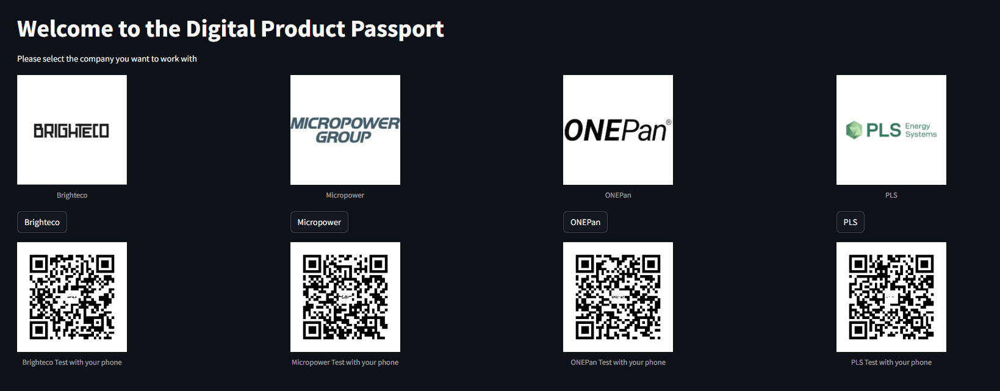
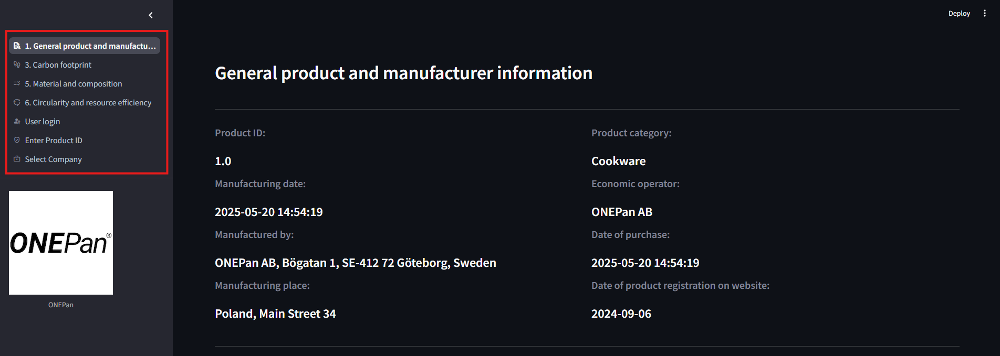
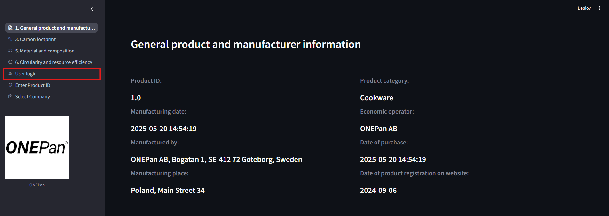
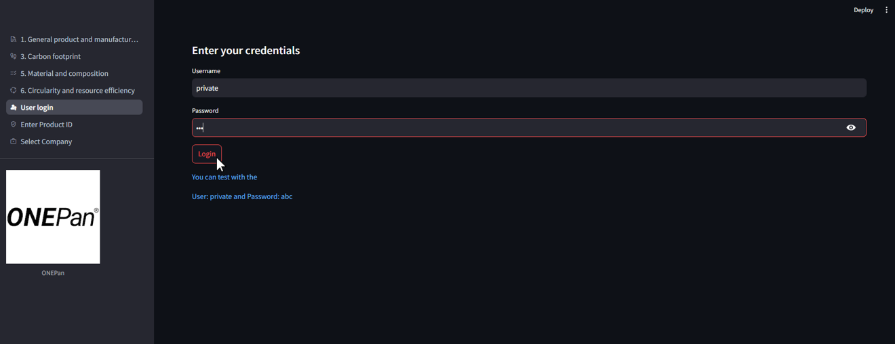

# Digital Product Passport (DPP) Application
_**A smartpass app for tracking product life cycle.**_

&nbsp;


## Add your files

- [ ] [Create](https://docs.gitlab.com/ee/user/project/repository/web_editor.html#create-a-file) or [upload](https://docs.gitlab.com/ee/user/project/repository/web_editor.html#upload-a-file) files
- [ ] [Add files using the command line](https://docs.gitlab.com/topics/git/add_files/#add-files-to-a-git-repository) or push an existing Git repository with the following command:

```
cd existing_repo
git remote add origin https://gitlab.com/smartpass/fullstack_app/dpp_smartpass.git
git branch -M main
git push -uf origin main
```

***


## Description
This is the Web Application of **Digital Product Passport** to track product life cycle.
_This can be changed as per requirement._

## Installation and Run Web Application

1. **Install Docker Desktop**

    - Download Docker Desktop as per your system configuration given below: 

        - For [Windows](https://docs.docker.com/desktop/setup/install/windows-install/)
        - For [Mac](https://docs.docker.com/desktop/setup/install/mac-install/)
        - For [Linux](https://docs.docker.com/desktop/setup/install/linux/)

- Install and login Docker Desktop in your system.

2. **Clone the repository**
```bash
git clone https://gitlab.com/smartpass/fullstack_app/dpp_smartpass.git
cd dpp_smartpass
```

3. **Build Multi-container docker application**

    - Build Multi-container docker application with the help of docker-compose.yml
        ```bash
        docker compose up
        ```
    - Check if the docker container is running or not.
        ```bash
        docker ps
        ```
    - If you want to stop the conainer.
        ```bash
        docker compose down
        ```

4. **Check logs in terminal/in docker desktop**

    - Open frontend address in browser: http://localhost:8501/

&nbsp;

## 1. Introduction
Welcome to the Digital Product Passport (DPP) application. This document provides a complete overview of the components of the application, user guides, and configuration instructions.

## 2. Application components

The application consists of two main parts: a backend API and a frontend Web Application.

### DPP_API (Backend)
* **Description**: This component serves as the company data storage and provides the Application Programming Interface (API). It is responsible for communicating and exchanging data with the `DPP_APP`.

### DPP_APP (Frontend)
* **Description**: This is the user-facing web application where Digital Product Passport parameters can be viewed and updated. All parameters shown in the app are fetched from the `DPP_API`.
* **Access Modes**: The application has two access levels:
    * **Public Mode**: Provides a basic view of product parameters.
    * **Private Mode**: Unlocked by logging in. This mode shows an increased number of parameters and gives users the ability to update them.

## 3. User Guide: How to Use the Application

This section describes the standard user workflow for viewing product data.

1.  **Select a Company**

2.  **Enter Product ID**: You can see the different parameters for your selected company's product ID.

3.  **Navigate Parameters**: You can now navigate through the different parameter categories for the product as shown in the picture below with red box. You are initially in **Public Mode**.

4.  **Log In for Private Access**: To see more detailed parameters or to make changes, you must log in with your user credentials. This will grant you access to **Private Mode**.



## 4. Feature Guide: Managing Product Updates

This feature allows authorized users to manage product updates in `Private Mode`. In `Public Mode`, you can only view existing updates.

### How to Add or Edit an Update

1.  **Authentication**: Ensure you are logged in to the application to enable `Private Mode`.
2.  **Add/Edit a Row**:
    * Click "Add Row" to create a new update entry.
    * > **Note on Non-Modifiable Fields**: For data integrity, some fields are set automatically and cannot be edited:
    * > * `Product ID`
    * > * `Update ID`
    * > * `Timestamp`
    * > **Special Case (Brighteco)**: For Brighteco products, `Actual total weight` parameter must be the sum of `Virgin material weight` + `Recycled content`.
3.  **Save or Cancel**:
    * Click **Save** to save your changes to the local database.
    * Click **Cancel** to discard your changes.

### Data Handling Concepts

1.  **Write data in data base**:
    * **Local Changes vs. Actual Changes**: Edits you make in the app are "local changes" and saved to the local database only. They are only written to the actual database and made permanent when you click **Write data in data base**.
2.  **Show all including historic updates**:    
    * **Update History**: The system is designed to preserve a complete history. An update never overwrites previous data; instead, it creates a new entry, ensuring all historical records are kept. They can be view by marking **Show all including historic updates**.

## 5. Developer Guide: System Configuration

This section explains how to modify and extend the DPP application's parameters and layout using the configuration file.

### Introduction

* **Purpose**: The configuration file controls the display names, categories, and layout of parameters within the `DPP_APP`.
* **Location**: You can find the configuration file at `[dpp_api/data/+ "company_name" + /parameter_metadata_"company_name".xlsx]`.

### Common Configurations

* **To modify an existing parameter name/category**: You will need to edit the appropriate fields in the configuration file to change how they appear in the `DPP_APP` layout.
* **To add a new parameter**: Adding a new parameter value requires updating the configuration file and the database.

### Configuration File Structure

The configuration file contains several sheets, each controlling a different aspect of the application.

#### `parameter_metadata` Sheet
* `category`
* `sub_category`
* `parameter`
* `order_parameter`
* `subparameter`
* `access` (e.g., public/private)
* `type` (e.g., string, number)
* `data model definition string` (Includes documentation about GS1 and Schema)

#### `category_metadata` Sheet
* `category`
* `function_name`
* `icon_category`: Uses [Google Material Symbols icons](https://fonts.google.com/icons?icon.set=Material+Symbols&icon.style=Rounded). The name should be lower case with spaces replaced by underscores (e.g., `info_icon`).

#### `sub_category_metadata` Sheet
* `sub_category`
* `conf_print`

## 6. Database Management

* **Location**: The database is located at `[Specify database location]`.


## Contributing
State if you are open to contributions and what your requirements are for accepting them.

For people who want to make changes to your project, it's helpful to have some documentation on how to get started. Perhaps there is a script that they should run or some environment variables that they need to set. Make these steps explicit. These instructions could also be useful to your future self.

You can also document commands to lint the code or run tests. These steps help to ensure high code quality and reduce the likelihood that the changes inadvertently break something. Having instructions for running tests is especially helpful if it requires external setup, such as starting a Selenium server for testing in a browser.

## Authors and acknowledgment
Show your appreciation to those who have contributed to the project.

## License
For open source projects, say how it is licensed.

## Project status
If you have run out of energy or time for your project, put a note at the top of the README saying that development has slowed down or stopped completely. Someone may choose to fork your project or volunteer to step in as a maintainer or owner, allowing your project to keep going. You can also make an explicit request for maintainers.
