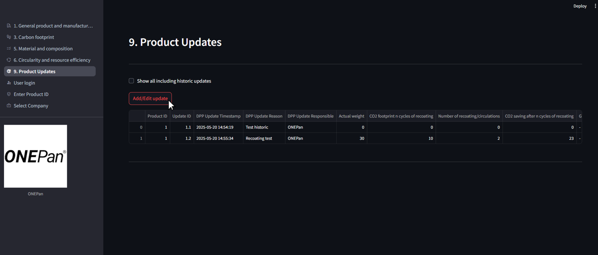
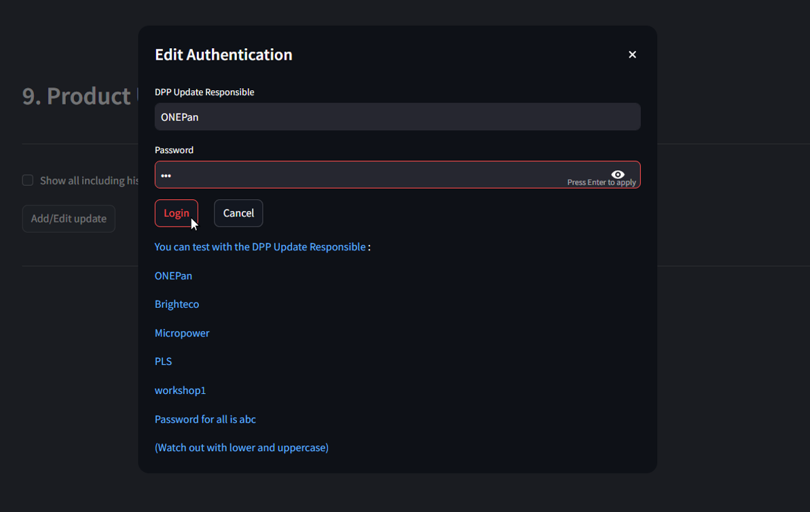
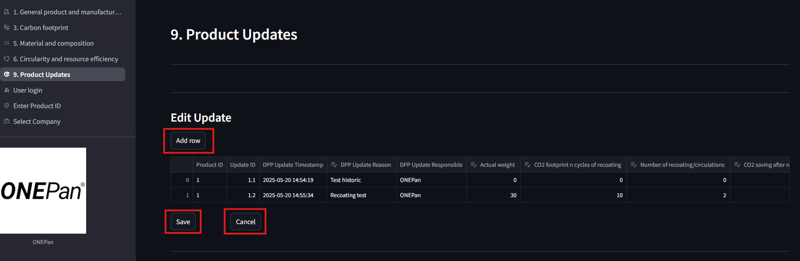
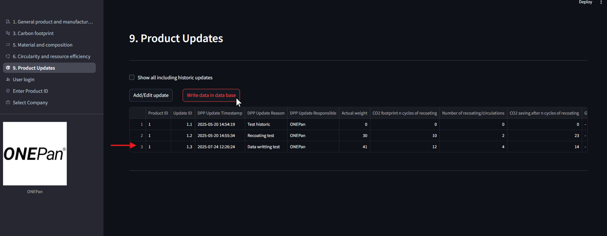
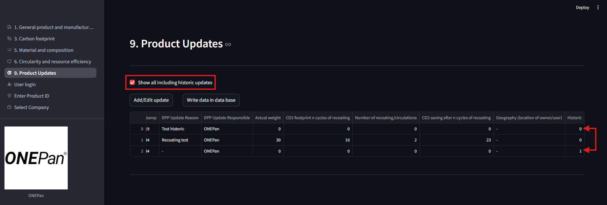

# Digital Product Passport (DPP) Application
_**Welcome to the Digital Product Passport (DPP) application. This document provides a complete overview of the components of the application, user guides, and configuration instructions.**_

***

&nbsp;

##  Table of Contents

<!-- vscode-markdown-toc -->
* 1. [ Add Your Files](#AddYourFiles)
* 2. [ Installation and Run Web Application](#InstallationandRunWebApplication)
	* 2.1. [ Install Docker Desktop](#InstallDockerDesktop)
	* 2.2. [ Clone the Repository](#ClonetheRepository)
	* 2.3. [ Build Multi-container Docker Application](#BuildMulti-containerDockerApplication)
	* 2.4. [ Check Logs in Terminal/in Docker Desktop](#CheckLogsinTerminalinDockerDesktop)
* 3. [ Application Components](#ApplicationComponents)
	* 3.1. [ DPP_API (Backend)](#DPP_APIBackend)
	* 3.2. [ DPP_APP (Frontend)](#DPP_APPFrontend)
* 4. [ User Guide: How to Use the Application](#UserGuide:HowtoUsetheApplication)
	* 4.1. [ Select a Company](#SelectaCompany)
	* 4.2. [ Enter Product ID:](#EnterProductID:)
	* 4.3. [ Navigate Parameters:](#NavigateParameters:)
	* 4.4. [ Log In for Private Access:](#LogInforPrivateAccess:)
* 5. [ Feature Guide: Managing Product Updates](#FeatureGuide:ManagingProductUpdates)
	* 5.1. [ How to Add or Edit an Update](#HowtoAddorEditanUpdate)
		* 5.1.1. [ Authentication:](#Authentication:)
		* 5.1.2. [ Add/Edit a Row:](#AddEditaRow:)
		* 5.1.3. [ Save or Cancel:](#SaveorCancel:)
	* 5.2. [ Data Handling Concepts](#DataHandlingConcepts)
		* 5.2.1. [ Write Data in Data Base:](#WriteDatainDataBase:)
		* 5.2.2. [ Show All Including Historic Updates:](#ShowAllIncludingHistoricUpdates:)
* 6. [ Developer Guide: System Configuration](#DeveloperGuide:SystemConfiguration)
	* 6.1. [ Configuration File](#ConfigurationFile)
		* 6.1.1. [ Configuration File Structure](#ConfigurationFileStructure)
	* 6.2. [ Database](#Database)

<!-- vscode-markdown-toc-config
	numbering=true
	autoSave=true
	/vscode-markdown-toc-config -->
<!-- /vscode-markdown-toc -->

***

&nbsp;

##  1. <a name='AddYourFiles'></a> Add Your Files

- [ ] [Create](https://docs.gitlab.com/ee/user/project/repository/web_editor.html#create-a-file) or [upload](https://docs.gitlab.com/ee/user/project/repository/web_editor.html#upload-a-file) files
- [ ] [Add files using the command line](https://docs.gitlab.com/topics/git/add_files/#add-files-to-a-git-repository) or push an existing Git repository with the following command:

```
cd existing_repo
git remote add origin https://gitlab.com/smartpass/fullstack_app/dpp_smartpass.git
git branch -M main
git push -uf origin main
```
***

&nbsp;

##  2. <a name='InstallationandRunWebApplication'></a> Installation and Run Web Application

###  2.1. <a name='InstallDockerDesktop'></a> Install Docker Desktop

- Download Docker Desktop as per your system configuration given below: 

    - For [Windows](https://docs.docker.com/desktop/setup/install/windows-install/)
    - For [Mac](https://docs.docker.com/desktop/setup/install/mac-install/)
    - For [Linux](https://docs.docker.com/desktop/setup/install/linux/)

- Install and login Docker Desktop in your system.

###  2.2. <a name='ClonetheRepository'></a> Clone the Repository
```bash
git clone https://gitlab.com/smartpass/fullstack_app/dpp_smartpass.git
cd dpp_smartpass
```

###  2.3. <a name='BuildMulti-containerDockerApplication'></a> Build Multi-container Docker Application

- Build Multi-container docker application with the help of docker-compose.yml
    ```bash
    docker compose up
    ```
- Check if the docker container is running or not.
    ```bash
    docker ps
    ```
- If you want to stop the conainer.
    ```bash
    docker compose down
    ```

###  2.4. <a name='CheckLogsinTerminalinDockerDesktop'></a> Check Logs in Terminal/in Docker Desktop

- Open frontend address in browser: http://localhost:8501/

***

&nbsp;

##  3. <a name='ApplicationComponents'></a> Application Components

The application consists of two main parts: a backend API and a frontend Web Application.

###  3.1. <a name='DPP_APIBackend'></a> DPP_API (Backend)
* **Description**: This component serves as the company data storage and provides the Application Programming Interface (API). It is responsible for communicating and exchanging data with the `DPP_APP`.

###  3.2. <a name='DPP_APPFrontend'></a> DPP_APP (Frontend)
* **Description**: This is the user-facing web application where Digital Product Passport parameters can be viewed and updated. All parameters shown in the app are fetched from the `DPP_API`.
* **Access Modes**: The application has two access levels:
    * **Public Mode**: Provides a basic view of product parameters.
    * **Private Mode**: Unlocked by logging in. This mode shows an increased number of parameters and gives users the ability to update them.

***

&nbsp;

##  4. <a name='UserGuide:HowtoUsetheApplication'></a> User Guide: How to Use the Application

This section describes the standard user workflow for viewing product data.

###  4.1. <a name='SelectaCompany'></a> Select a Company

&nbsp;

###  4.2. <a name='EnterProductID:'></a> Enter Product ID:
* Enter product ID which you want to see.

&nbsp;

###  4.3. <a name='NavigateParameters:'></a> Navigate Parameters:
* You can now navigate through the different parameter categories for the product as shown in the picture below with red box. You are initially in `Public Mode`.

&nbsp;

###  4.4. <a name='LogInforPrivateAccess:'></a> Log In for Private Access:
* To see more detailed parameters or to make changes, you must log in with your user credentials. This will grant you access to `Private Mode`.

* Here you can Enter your credentials to get access to `Private Mode`.


***

&nbsp;

##  5. <a name='FeatureGuide:ManagingProductUpdates'></a> Feature Guide: Managing Product Updates

This feature allows authorized users to manage product updates in `Private Mode`. In `Public Mode`, you can only view existing updates.

###  5.1. <a name='HowtoAddorEditanUpdate'></a> How to Add or Edit an Update

Navigate to Product Updates `(9. Product Updates)`.

####  5.1.1. <a name='Authentication:'></a> Authentication:
* Ensure you are logged in to the application to enable `Private Mode`.
* To add or edit an update click `Add/Edit update` which opens pop-up for user authentication.


####  5.1.2. <a name='AddEditaRow:'></a> Add/Edit a Row:
* Click `Add row` to create a new update entry.
* > **Note on Non-Modifiable Fields**: For data integrity, some fields are set automatically and cannot be edited such as: `Product ID`, `Update ID`, and `Timestamp`
* > **Special Case (Brighteco)**: For Brighteco products, `Actual total weight` parameter must be the sum of `Virgin material weight` + `Recycled content`.
####  5.1.3. <a name='SaveorCancel:'></a> Save or Cancel:
* Click `Save` to save your changes to the local database.
* Click `Cancel` to discard your changes.



###  5.2. <a name='DataHandlingConcepts'></a> Data Handling Concepts

####  5.2.1. <a name='WriteDatainDataBase:'></a> Write Data in Data Base:
* **Local Changes vs. Actual Changes**: Edits you make in the app are "local changes" and saved to the local database only. They are only written to the actual database and made permanent when you click `Write data in data base`.


####  5.2.2. <a name='ShowAllIncludingHistoricUpdates:'></a> Show All Including Historic Updates:    
* **Update History**: The system is designed to preserve a complete history. An update never overwrites previous data; instead, it creates a new entry, ensuring all historical records are kept. They can be view by marking:
    - [x] **Show all including historic updates**.


***

&nbsp;

##  6. <a name='DeveloperGuide:SystemConfiguration'></a> Developer Guide: System Configuration

This section explains how to modify and extend the DPP application's parameters and web application layout using `configuration file`.

* **To Modify an Existing Parameter Name/Category**: You will need to edit the appropriate fields in the configuration file to change how they appear in the `DPP_APP` layout.
* **To Add a New Parameter**: Adding a new parameter value requires updating the configuration file and the database _(e.g., You want to add a new parameter, you need to add a raw in `[dpp_api/data/ + "company_name" + /parameter_metadata_"company_name".xlsx]` and a column in `[dpp_api/data/ + "company_name" + /static.csv]` if the new parameter is static or else in `[dpp_api/data/ + "company_name" + /dynamic.csv]`)_.

###  6.1. <a name='ConfigurationFile'></a> Configuration File

* **Purpose**: The `configuration file` controls the display names, categories, and layout of parameters within the `DPP_APP`.
* **Location**: You can find the `configuration file` at `[dpp_api/data/ + "company_name" + /parameter_metadata_"company_name".xlsx]`.


####  6.1.1. <a name='ConfigurationFileStructure'></a> Configuration File Structure

* The configuration file contains several sheets, each controlling a different aspect of the application.

* `parameter_metadata` Sheet
	* `category`
	* `sub_category`
	* `parameter`
	* `order_parameter`
	* `subparameter`
	* `access` (e.g., public/private)
	* `type` (e.g., string, number)
	* `data model definition string` (Includes documentation about GS1 and Schema)

* `category_metadata` Sheet
	* `category`
	* `function_name`
	* `icon_category`: Uses [Google Material Symbols icons](https://fonts.google.com/icons?icon.set=Material+Symbols&icon.style=Rounded). The name should be lower case with spaces replaced by underscores (e.g., `info_icon`).

* `sub_category_metadata` Sheet
	* `sub_category`
	* `conf_print`

***

&nbsp;

###  6.2. <a name='Database'></a> Database

* **Purpose**: This is a basic representation of the company database. It contains the data itself.
* **Location**: The databases are saved as two different types.
    1. dynamic
    2. static

    They are located at `[dpp_api/data/ + "company_name" + /dynamic.csv]` and `[dpp_api/data/ + "company_name" + /static.csv]`.